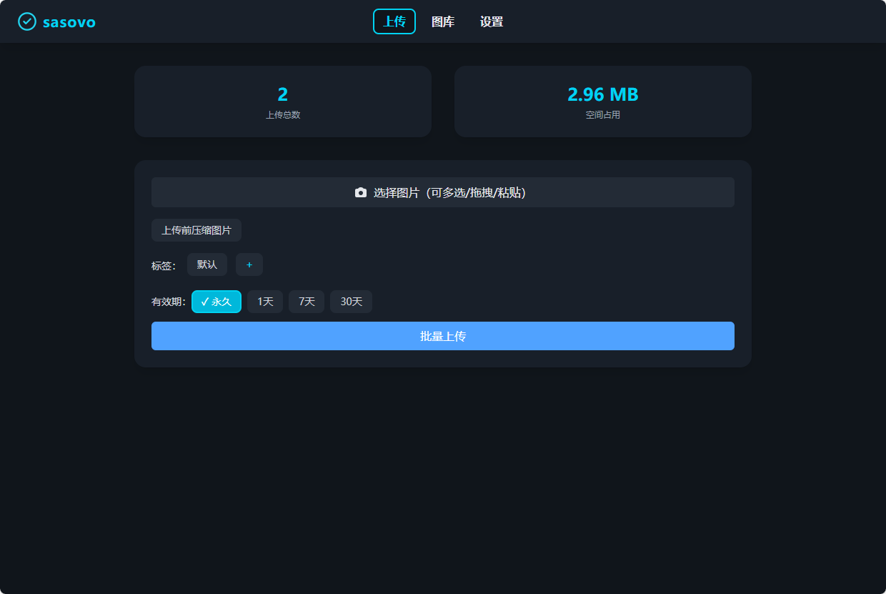

<h1 align="center">Sasovo Cloudflare Workers 图床</h1>

> 基于 Cloudflare Workers + Telegram Bot 的免费图片直链/图床系统，支持多文件上传、批量管理、标签分类、现代美观 UI。
> [感谢原项目,根据此项目修改而来](https://github.com/houhoz/cf-workers-telegram-image)
> 感谢cursor，一个前端苦手发自内心的感谢

## 让cloudflare再次伟大！

项目图片


---

## ✨ 主要特性

- **多文件上传**：支持批量、拖拽、粘贴、压缩上传
- **永久直链**：图片直链可用于 Markdown/HTML/外链
- **标签分类**：支持标签管理与筛选
- **批量操作**：批量删除、导出历史记录
- **现代 UI**：深色主题、卡片风格、响应式设计
- **Cloudflare D1**：数据安全、全球加速、免费额度
- **自定义页面标题/网站图标**：支持在设置页自定义网站标题和 favicon
- **缩略图支持**：图库和详情页自动使用缩略图，节省流量、加速加载
- **多级文件夹与面包屑导航**：支持多级文件夹管理、面包屑导航，图片可批量移动/复制到任意文件夹

---

## 🚀 快速开始

1. **准备账号和信息**
   - 注册 Cloudflare 账号。
   - 登录 Cloudflare 控制台，左侧菜单点击“Workers & Pages”，进入 Workers 页面。
   - 点击“D1”标签页，创建一个新的 D1 数据库，输入你喜欢的数据库名字（比如 telegram_image_db），记住这个名字。
   - 进入右上角头像 → My Profile → API Tokens → Create Token。
     - 选择“Cloudflare Workers”模板。
     - 在权限设置页面，点击“+ Add more permissions”，选择“Account / Workers D1 / Edit”，这样你的 Token 就有 D1 数据库的管理权限。
     - 生成 Token，记住并复制（只显示一次），粘贴到 GitHub 仓库的 Secrets 里（变量名 CF_API_TOKEN）。
   - 注册 Telegram 机器人，拿到 Bot Token。
   - 用 @getidbot 获取你的 Telegram Chat ID。

2. **Fork 本项目到你自己的 GitHub 账号**

3. **在 GitHub 仓库设置 Secrets（Settings → Secrets and variables → Actions）**
   - CF_API_TOKEN：你的 Cloudflare API Token（需要有 Worker 和 D1 权限）
   - D1_DATABASE_NAME：你的 D1 数据库名字（比如 telegram_image_db）
   - TG_BOT_TOKEN：你的 Telegram Bot Token
   - TG_CHAT_ID：你的 Telegram Chat ID
   - ADMIN_USER：登录用户名
   - ADMIN_PASS：登录密码
   - SHORTLINK_DOMAIN：自定义短链域名（可选，不填也行）

4. **首次部署：手动触发 GitHub Actions 部署**
   - 打开你的 GitHub 仓库，点击上方的“Actions”标签。
   - 选择左侧的“Deploy to Cloudflare Workers”工作流。
   - 右侧点击绿色的“Run workflow”按钮，直接点击即可（不用填写参数）。
   - 等待几分钟，看到绿色对勾就代表部署成功。

5. **首次部署后，手动初始化数据库表结构**
   - 打开 Cloudflare 控制台 → Workers & Pages → D1 → 你的数据库 → Console
   - 执行以下 SQL 创建 images 表：
   ```sql
   CREATE TABLE IF NOT EXISTS images (
     id INTEGER PRIMARY KEY AUTOINCREMENT,
     file_id TEXT NOT NULL,
     thumb_file_id TEXT,
     chat_id TEXT NOT NULL,
     short_code TEXT UNIQUE NOT NULL,
     expire_at TIMESTAMP,
     tags TEXT,
     filename TEXT,
     size INTEGER,
     created_at TIMESTAMP DEFAULT CURRENT_TIMESTAMP
   );
   ```

6. **访问你的域名**

---

## 💡 常见问题

- **图片直链无法访问？**
  - 检查 wrangler.json 不要配置 assets，所有路由交给 Worker 处理
- **如何自定义页面标题/网站图标？**
  - 进入“设置”页面，输入标题或上传 favicon 并保存即可，支持本地持久化

---

## 🛠️ 手动部署方式（进阶/自定义需求）

1. **本地安装 wrangler**
   ```sh
   npm install -g wrangler
   # 或用 pnpm/yarn 安装
   ```

2. **本地新建 wrangler.toml 并填写你的 D1 配置**
   ```toml
   name = "cf-workers-telegram-image"
   main = "./src/worker/index.ts"
   compatibility_date = "2025-07-22"
   compatibility_flags = ["nodejs_compat"]

   [[d1_databases]]
   binding = "DB"
   database_name = "你的数据库名"
   database_id = "你的数据库ID"
   ```

3. **手动注入 secrets（只需一次）**
   ```sh
   wrangler secret put TG_BOT_TOKEN
   wrangler secret put TG_CHAT_ID
   wrangler secret put ADMIN_USER
   wrangler secret put ADMIN_PASS
   wrangler secret put SHORTLINK_DOMAIN # 可选
   ```

4. **部署到 Cloudflare Workers**
   ```sh
   wrangler deploy
   ```

5. **首次部署后，去 Cloudflare D1 控制台执行 SQL 初始化表结构（同上）**

---

> 详细接口说明请见 [api.md](./api.md)。

---

## 🙏 致谢

- [Cloudflare Workers](https://workers.cloudflare.com/)
- [Telegram Bot API](https://core.telegram.org/bots/api)
- [Tailwind CSS](https://tailwindcss.com/)
- [Hono](https://hono.dev/)

---

> MIT License | By Sasovo
